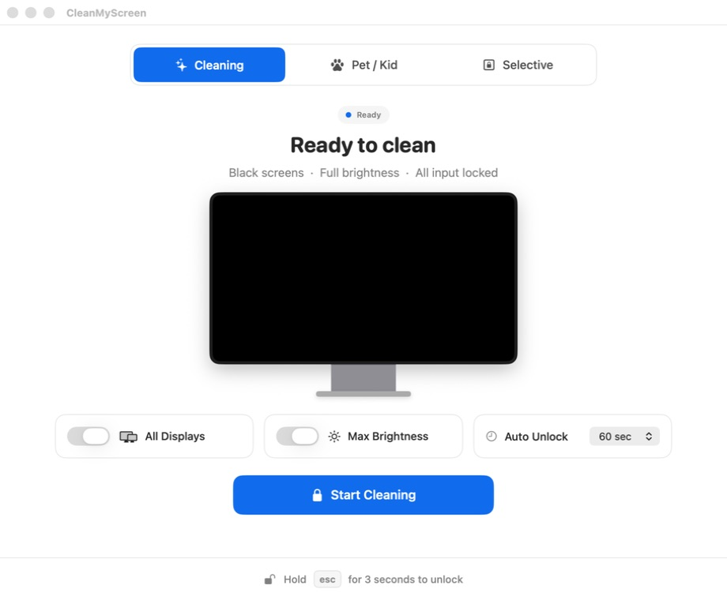
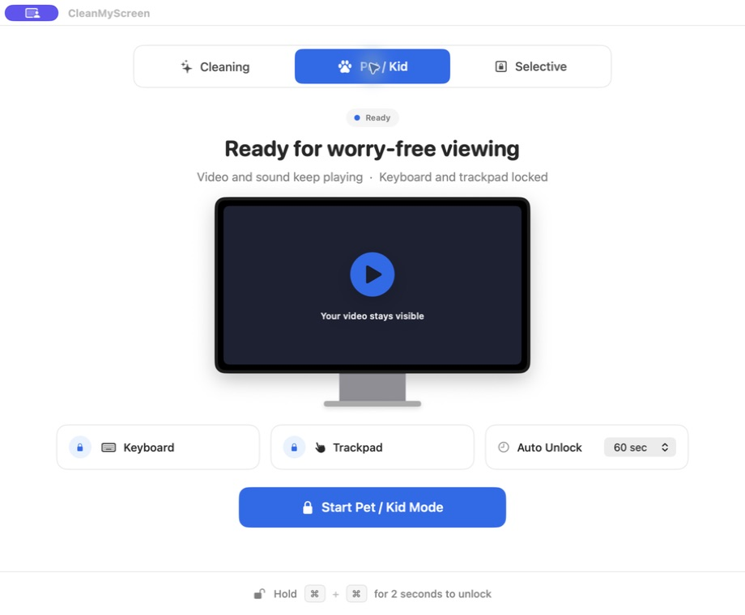
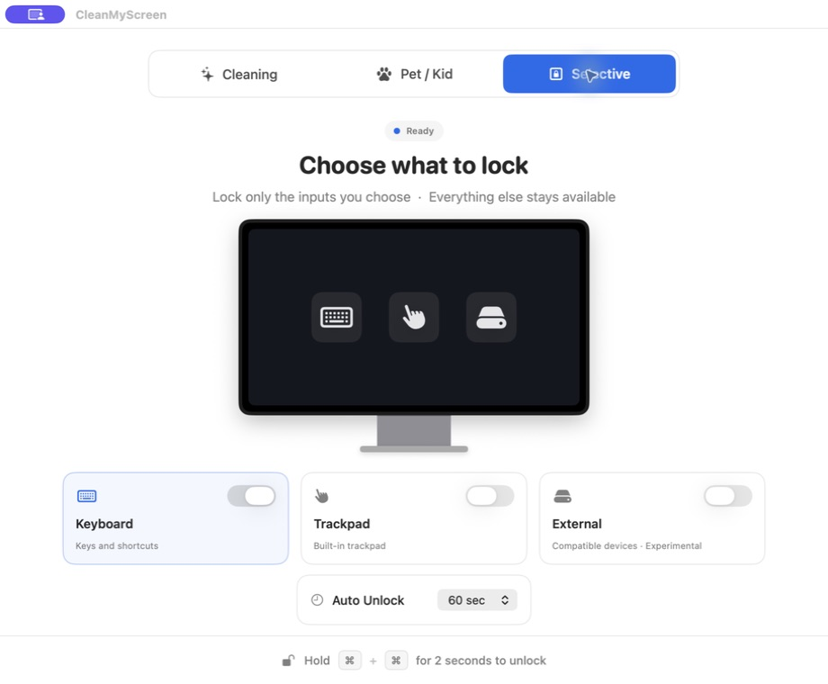

# CleanMyScreen

<p align="center">
  
</p>

CleanMyScreen is a free, open-source macOS utility for temporarily blocking accidental keyboard and pointer input while you clean a display, play a video for a child, or let a pet sit near your Mac.

It is built natively with SwiftUI, AppKit, Core Graphics, and IOKit. There are no accounts, payments, trials, subscriptions, telemetry, or network access.

[Download the latest release](https://github.com/opensource-works/CleanMyMac/releases/latest) · [View the source](https://github.com/opensource-works/CleanMyMac) · [MIT License](LICENSE)

## Modes

| Mode | What stays visible | What is locked |
| --- | --- | --- |
| **Cleaning** | Pure-black overlays on one or every display | Keyboard and pointer input |
| **Pet / Kid** | Your current video, webpage, or application | Keyboard and trackpad/pointer input |
| **Selective** | Your current desktop | Keyboard, built-in trackpad, compatible external devices, or any combination |

Every session includes a three-second countdown, an optional automatic timeout, and a three-second Escape-key emergency unlock gesture. Ending a session restores overlays, the cursor, seized devices, and every brightness value the app was able to change.



<p align="center">
  
  
</p>

## Download and install

Choose the DMG that matches your Mac:

- `CleanMyScreen-arm64.dmg` for Apple Silicon Macs (M1, M2, M3, M4 and newer)
- `CleanMyScreen-x86_64.dmg` for Intel Macs

Open the DMG and drag CleanMyScreen into Applications. The current public builds are ad-hoc signed rather than notarized with a paid Apple Developer ID. On first launch, macOS may require you to open the app from Finder and confirm it in **System Settings → Privacy & Security**.

Published SHA-256 hashes are available in `SHA256SUMS.txt` on the release page.

## macOS permissions

macOS requires **Input Monitoring** before an app can observe and suppress input sent to other applications. CleanMyScreen asks for it only when a lock session needs it. If macOS no longer repeats its permission prompt, the app offers a button that opens the exact Input Monitoring pane. On configurations where the active event filter remains unavailable, it also links directly to Accessibility as a compatibility fallback.

The app does not record, store, transmit, or inspect keystroke contents.

## Build from source

Apple's Swift command-line tools are enough for local development:

```sh
./Scripts/run-tests.sh
./Scripts/build-app.sh
./Scripts/build-dmgs.sh
open dist/CleanMyScreen.app
```

`build-app.sh` produces a universal Apple Silicon + Intel application and applies an ad-hoc local signature. `build-dmgs.sh` creates separate architecture-specific disk images, verifies them, and writes their SHA-256 hashes.

`run-tests.sh` uses Swift Testing's bundled framework because Command Line Tools alone do not include the `xctest` launcher. With full Xcode installed, `swift test` can be used directly.

Full Xcode is only required for an Xcode project workflow, Developer ID signing, notarization, or App Store distribution. The current brightness implementation uses a private CoreDisplay fallback, so an App Store build must replace or disable that capability before submission. Local and Developer ID distribution are the intended paths for this release.

## Hardware limits

- Brightness control is best-effort because macOS has no single public brightness API for every built-in and external display. Unsupported displays remain at their current brightness.
- Device-specific trackpad and external-device locking depends on what the connected HID hardware and macOS allow the app to seize. If a device cannot be safely isolated, the app reports the limitation and leaves that input available.
- On a desktop Mac with no built-in keyboard, one external keyboard is deliberately kept available for the emergency unlock gesture.
- Devices connected after a session starts may remain available until that session is restarted.
- CleanMyScreen is an accidental-input guard, not a login lock, parental-control boundary, or security product. Power, Touch ID, force quit, and other system-reserved operations remain available.

## License

CleanMyScreen is released under the [MIT License](LICENSE).


本项目积极参与并认可 [LINUX DO 社区](https://linux.do/)
